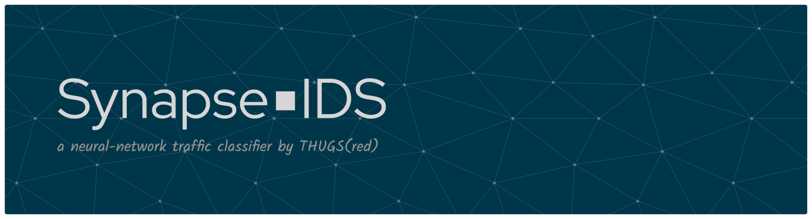
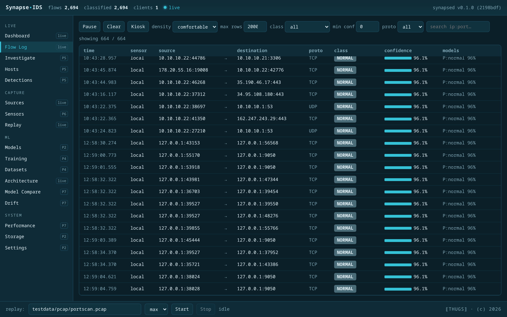
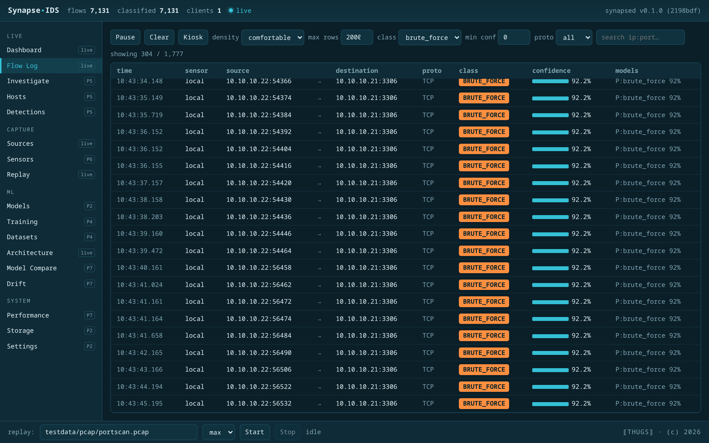
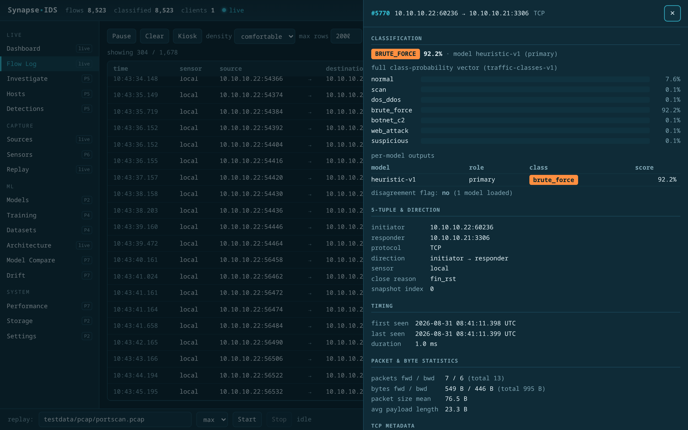
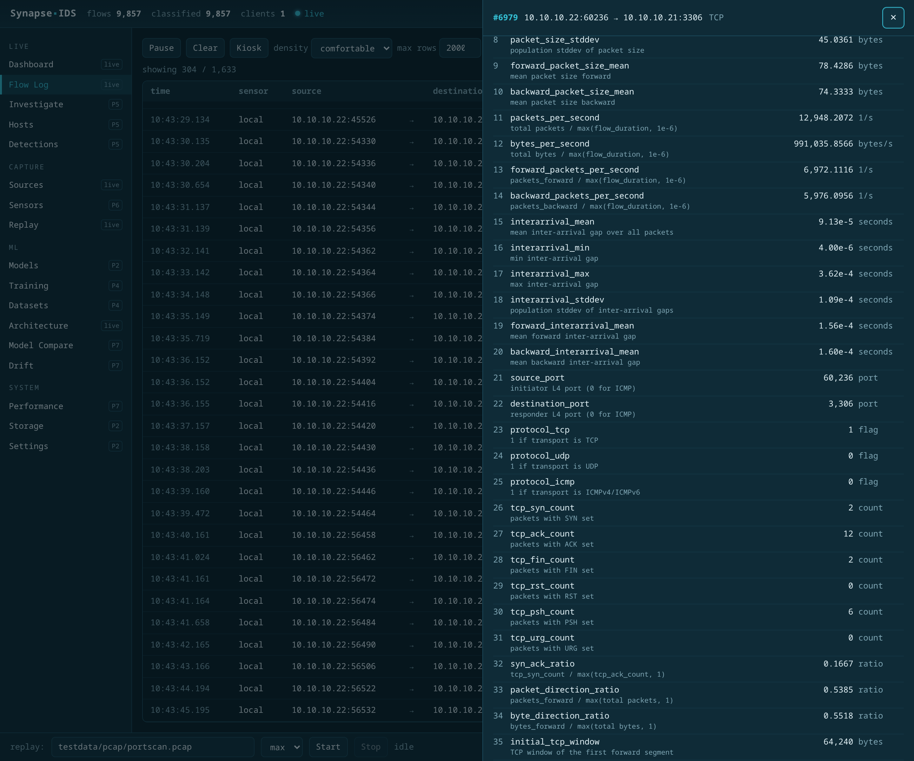
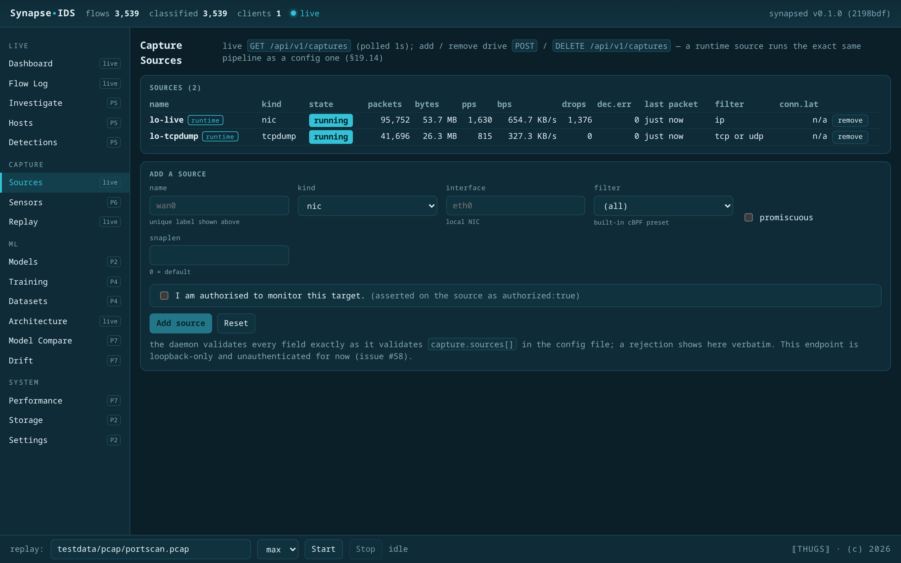
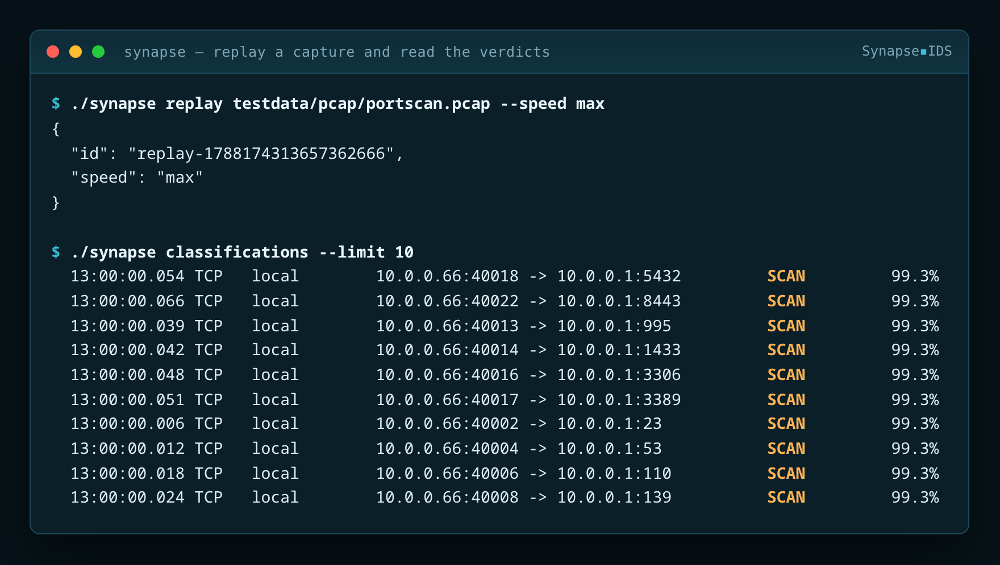
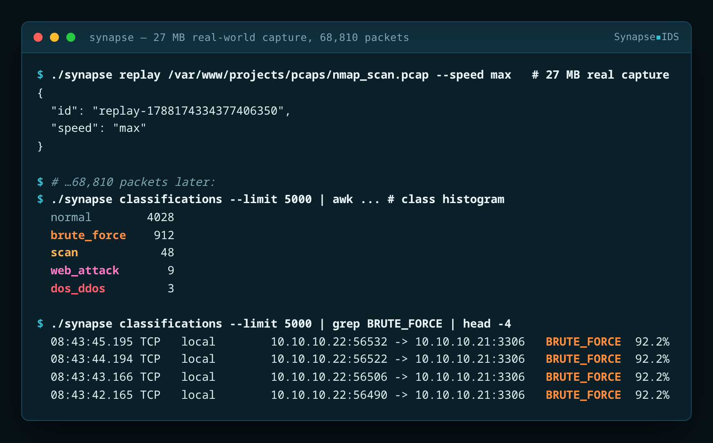
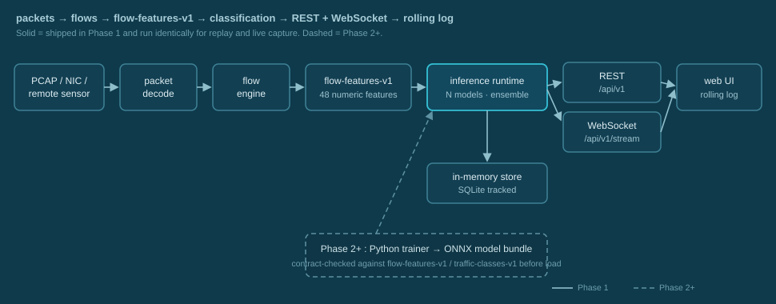

<p align="center"></p>

<div align="center">

# SynapseIDS

**Neural-network network intrusion detection & live traffic classification — packets become flows, flows become features, features get classified, and every verdict streams to your screen.**

<br/>


<br/>

<samp>one Go daemon · replay runs the real pipeline · 48-feature frozen contract · live WebSocket rolling log · four static Linux targets + `.deb`</samp>

</div>

<br/>

> [!IMPORTANT]
> **SynapseIDS is in early development — this is Phase 1 of an [8-phase plan](#roadmap).** No release is tagged yet; build from source today.
>
> **Working now:** PCAP replay → the flow engine → the frozen `flow-features-v1` vector (48 features) → a transparent rule-based classifier → the `/api/v1` REST surface → a React operator console at `/` (Dashboard, full-screen Flow Log, Flow Inspector, Hosts, Investigate, Timeline, Replay control) fed by a live WebSocket. Replay runs the *exact* pipeline live capture will.
>
> **Not here yet:** live NIC / tcpdump / SSH capture, trained ONNX models wired into the daemon, SQLite persistence (storage is in-memory only), and the sensor-topology view (a `synapse-sensor` agent **does** work, in both directions and in all three `raw` / `flow` / `feature` modes — see [ADR 0018](docs/adr/0018-daemon-side-synpoip-collector-and-sensor-identity.md) and [ADR 0024](docs/adr/0024-sensor-modes-and-synpoip-record-frames.md)), and the rest of the [§19](PROJECT.md) UI beyond the four Phase-1 views (every other route in the SPA is a "Planned — Phase N" placeholder). The offline Python trainer that produces model bundles now lives in [`trainer/`](trainer/) (Phase 2, not yet wired to the daemon). See [the roadmap](#roadmap).

<br/>

## 📑 Table of Contents

- [✨ Why SynapseIDS](#why)
- [🖥️ What it looks like](#look)
- [🧠 The pipeline](#pipeline)
- [📦 Install](#install)
- [🚀 Usage](#usage)
- [🧪 Development](#development)
- [🗺️ Roadmap](#roadmap)
- [🔐 Security](#security)
- [📄 License](#license)

<br/>

<a id="why"></a>

## ✨ Why SynapseIDS

| | |
|---|---|
| 🔻 **One pipeline, packets to verdict** | `capture → packet decode → flow engine → flow-features-v1 → inference runtime → REST + WebSocket → rolling log`. Every stage is a separate Go package behind an explicit interface; nothing downstream knows whether a packet came from a file or a NIC. |
| 🧊 **Frozen, versioned contracts** | `flow-features-v1` is 48 ordered numeric features; `traffic-classes-v1` is 7 ordered classes. Both are embedded in the binary, served at `/api/v1/schemas/*`, and self-checked on startup. A released schema is never reordered — a change means a new version — and a model whose contract does not match is rejected *before* it runs. |
| 🎛️ **Ensemble-ready inference** | The runtime scores every flow through all loaded models, stores each model's own class vector (not just the merged verdict), and flags disagreement as a first-class signal. Phase 1 loads one model — `heuristic-v1`, role `primary` — and the ensemble plumbing is already there for the ONNX models in Phase 2. |
| 🔁 **Replay is not a special case** | `synapse replay` feeds packets through the identical `flow → features → inference → store → events` path as live capture, so the rolling log behaves the same for a captured file and (later) a live interface. |
| 🔎 **Transparent Phase-1 classifier** | The stand-in model is rule-based and readable: a firm `normal` baseline, explicit rules for `scan` / `dos_ddos` / `brute_force` / `web_attack` / `botnet_c2`, and `suspicious` for "odd but not conclusive" rather than forcing a guess into an attack class. |
| 📦 **Zero-dependency data plane** | Pure Go, `CGO_ENABLED=0`, standard library only — `go.mod` has no third-party `require`. Four static Linux targets (`amd64`, `386`, `arm64`, `arm` v7) plus a `.deb` for each, built by `make`. |
| 🛡️ **Defensive only** | SynapseIDS observes, classifies, explains, and alerts. It has no capability to attack, modify, or inject traffic, by design. The management API binds to `127.0.0.1` unless you change it. |

<br/>

<a id="look"></a>

## 🖥️ What it looks like

Real screenshots of a running daemon — more in
[`assets/screenshots/`](assets/screenshots/), including the Dashboard, the
Architecture builder and the CLI transcripts.

### The full-screen rolling flow-classification log

The primary product view — a kiosk-style stream that appends a row per classified flow and never blocks the capture path behind it.

<p align="center"></p>

Filter the stream and the attack classes stand out — here a real MySQL
credential-stuffing run picked out of ordinary browsing traffic:

<p align="center"></p>

<sub>The class cell is colour-coded per class, rows below 60% confidence are dimmed, and model disagreement draws an accent bar on the left edge. <b>Pause</b> freezes the view without dropping backend events, and a replay appears in the same stream. Phase-1 replays report sensor <code>local</code>; multi-sensor names arrive with distributed capture (Phase 6). Every <code>NORMAL</code> verdict from the Phase-1 heuristic sits at ~96.1% by construction; port-scan probes land at ~99.3%.</sub>

### The flow inspector

Select any row to explain the verdict against the raw feature vector and every model's output.

<p align="center"></p>

Scroll it for all 48 raw `flow-features-v1` values, each joined to the frozen
schema so it carries its own name, calculation and unit:

<p align="center"></p>

<sub>Values come from <code>GET /api/v1/flows/{id}</code> + <code>GET /api/v1/schemas/features</code>. Human-review status is live (<code>GET /api/v1/review/{flow_id}</code>, §16).</sub>

The drawer also explains the verdict rather than just stating it. For the Phase-1
heuristic the account is **exact** — `GET /api/v1/flows/{id}/explain` lists the
rules that fired and the feature values their conditions compared, so
`BRUTE_FORCE 92.2%` reads as "because `destination_port=3306`,
`packets_forward=7`, `packets_backward=6`, `tcp_fin_count=2`,
`flow_duration=0.00086s`". Alongside it: what each model actually received (the
heuristic reads raw values and says so; a trained model shows raw → its own
bundle's normalizer → normalized), and `GET /api/v1/flows/{id}/snapshots` for how
a long flow's counters and verdict evolved across its periodic snapshots.

Two things it deliberately does **not** show. There is **no baseline column** —
behavioural baselines are Phase 7, so `baseline.available` is `false` with no
value field, because a fabricated expected range would turn "never checked" into
"checked and clean". And there is **no per-feature attribution for trained
models** — that needs gradients or SHAP, and a rough linear proxy drawn in an
explanation panel reads as an explanation, so the panel says the attribution is
not implemented instead. The anomaly score is a labelled Phase-7 gap.
See [ADR 0025](docs/adr/0025-flow-inspector-explanation-and-snapshots.md).

### Live capture sources

Every source — a local NIC, a `tcpdump` subprocess, an authorized remote `ssh … tcpdump`, or a PCAP-over-IP sensor — merges into the one pipeline, with per-source packets, rates, kernel drops and error state.

<p align="center"></p>

### and from the CLI

<p align="center"></p>

A 27 MB real-world capture — ordinary browsing plus an `nmap` scan and a MySQL brute-force attempt — replayed through the same pipeline:

<p align="center"></p>

<br/>

<a id="pipeline"></a>

## 🧠 The pipeline

<p align="center"></p>

A capture source — a PCAP file today, a NIC / tcpdump stream / remote sensor later — produces decoded packets. The **flow engine** groups them into bidirectional flows on a direction-normalized 5-tuple and closes a flow on TCP FIN/RST, a 30 s idle gap, a 5 min lifetime cap, or capture end; long-lived flows emit a snapshot every 60 s so a verdict never waits indefinitely for a flow to finish.

Each closed or snapshotted flow becomes one **`flow-features-v1`** vector: 48 numeric features derived only from that flow — packet and byte counts, rates, size statistics, inter-arrival timing, TCP-flag tallies, direction ratios, and internal/external context — and never from raw IP addresses. The **inference runtime** scores the vector through every loaded model, keeps each model's full class distribution and top class, and sets a disagreement flag when non-anomaly models pick different classes.

The verdict plus the flow record go into the in-memory store (the most recent ~50,000 of each) and onto an in-process **event bus**; a full subscriber drops events and counts them rather than stalling ingestion. The API pump batches those events to WebSocket clients every 100 ms, and the page at `/` renders the stream as the rolling log. `synapse replay` runs this identical path, which is why replayed and live traffic look the same on screen.

The Phase-2 **`synapse-trainer`** (Python/PyTorch, in [`trainer/`](trainer/)) is the offline other half: it reads a labelled `flow-features-v1` dataset and exports a self-describing bundle — `model.onnx` (opset 17, softmax baked in) plus `metadata.json`, `normalizer.json`, `metrics.json` and `training-recipe.json` — that a Go ONNX runtime will validate and load. See [ADR 0007](docs/adr/0007-python-trainer-and-bundle-export.md) for the bundle contract.

The output contract, **`traffic-classes-v1`** (frozen, 7 classes):

- `normal` — benign traffic
- `scan` — host / port / service discovery
- `dos_ddos` — denial of service or distributed denial of service
- `brute_force` — credential brute force against a service
- `botnet_c2` — botnet command-and-control channel
- `web_attack` — web application attack (injection, traversal, RCE attempt)
- `suspicious` — anomalous but unattributed — **a supervised catch-all class, not an anomaly score.** A separate novelty/anomaly model is Phase 7.

<br/>

<a id="install"></a>

## 📦 Install

Requires **Go 1.27+**. No C toolchain and no third-party Go modules. _No release is tagged yet — build from source. `make dist && make deb` produce the `.tar.gz` archives, `.deb` packages and `SHA256SUMS` that the release workflow attaches to a tag._

### 🔨 From source

```bash
git clone https://github.com/kawaiipantsu/synapseids.git
cd synapseids
make build            # builds synapsed, synapse, synapse-sensor — CGO_ENABLED=0, static
./synapsed --version
```

### 🌍 Cross-compile

```bash
make build-linux      # dist/synapseids_<ver>_linux_{amd64,386,arm64,arm}/{synapsed,synapse,synapse-sensor}
make build-freebsd    # dist/synapseids_<ver>_freebsd_{amd64,arm64}/…  — the OPNsense sensor
make build-all        # both
```

<div align="center">

| `make` target | `GOARCH` | package arch | `uname -m` |
|:--|:--|:--:|:--|
| 🐧 `linux/amd64` | `amd64` | `.deb` `amd64` | `x86_64` |
| 🐧 `linux/386` | `386` | `.deb` `i386` | `i686` |
| 🐧 `linux/arm64` | `arm64` | `.deb` `arm64` | `aarch64` |
| 🐧 `linux/arm` (v7, `GOARM=7`) | `arm` | `.deb` `armhf` | `armv7l` |
| 😈 `freebsd/amd64` | `amd64` | `.pkg` `FreeBSD:14:amd64` | `amd64` |
| 😈 `freebsd/arm64` | `arm64` | `.pkg` `FreeBSD:14:aarch64` | `arm64` |

</div>

The four Linux targets are the release contract ([§27, §28.16](PROJECT.md)). The two FreeBSD
targets exist for the OPNsense sensor ([ADR 0014](docs/adr/0014-freebsd-bpf-capture-and-the-opnsense-sensor-plugin.md));
`synapse-sensor` is the binary that must build there, and `synapsed`/`synapse` ride along because they happen to.

### 📦 Debian / Ubuntu

```bash
sudo dpkg -i synapseids_<version>_amd64.deb      # or _i386 / _arm64 / _armhf
```

One package (`synapseids`) carries all three binaries, a man page each, and DEP-5 copyright. No `Depends` — the binaries are static.

### ⚡ One line (Linux, no sudo)

```bash
curl -fsSL https://raw.githubusercontent.com/kawaiipantsu/synapseids/main/install.sh | sh
```

Detects your arch, downloads the matching release archive, verifies it against `SHA256SUMS`, and installs all three binaries to `~/.local/bin` (or `/usr/local/bin` when writable). Pin with `SYNAPSEIDS_VERSION=v0.1.0`; redirect with `SYNAPSEIDS_INSTALL=/opt/bin`.

<br/>

<a id="usage"></a>

## 🚀 Usage

```bash
# 1. start the daemon — management API on 127.0.0.1:8080 by default
synapsed &

# 2. open the live rolling log
xdg-open http://127.0.0.1:8080/

# 3. replay a committed fixture through the real pipeline
synapse replay testdata/pcap/portscan.pcap --speed max

# 4. read the results back
synapse status
synapse classifications --limit 50
curl -s http://127.0.0.1:8080/api/v1/status | jq .
curl -s 'http://127.0.0.1:8080/api/v1/classifications?limit=50' | jq .
```

**`synapsed`** — `--config FILE` (JSON config), `--listen HOST:PORT` (default `127.0.0.1:8080`), `--capture IFACE` (repeatable — capture live traffic from a NIC, Phase 3), `--version`. Binding off loopback logs a warning; put an authenticating proxy in front.

Live capture (Phase 3): `synapsed --capture eth0` opens an `AF_PACKET` raw socket and runs the interface through the same pipeline a replay uses; `GET /api/v1/captures` then shows it counting packets, bytes, pps/bps and kernel drops. Equivalent JSON config: `capture.sources: [{ "name": "eth0", "kind": "nic", "interface": "eth0", "promiscuous": true, "filter": "" }]` (`filter` is `""` or a built-in cBPF preset — `ip`, `ip6`, `ip-any`, `not-arp`); or set `SYNAPSE_CAPTURE_IFACE`. Needs `CAP_NET_RAW` (and `CAP_NET_ADMIN` for promiscuous mode) — not root; the `contrib/systemd` unit grants both. A source that cannot open is logged and skipped, and the API keeps serving.

PCAP-over-IP (Phase 3): a `capture.sources` entry of `kind: "pcap-over-ip"` consumes a framed, authenticated TLS stream from a remote sensor over the **SYNPOIP** protocol ([`internal/capture/pcapoverip/PROTOCOL.md`](internal/capture/pcapoverip/PROTOCOL.md), [ADR 0012](docs/adr/0012-pcap-over-ip-transport.md)):

```jsonc
{ "name": "hq-sensor", "kind": "pcap-over-ip",
  "addr": "10.20.0.9:4789",
  "token_file": "/etc/synapse/poip.token",  // never inline a token (§23); or set SYNAPSE_POIP_TOKEN
  "ca_file": "/etc/synapse/sensor-ca.pem",   // pin the sensor cert; omit to use system roots
  "authorized": true }                       // required for a non-loopback addr, insecure_tls, or no token (§21/§28.18)
```

Optional: `server_name` (TLS SNI / cert name), `client_cert_file` + `client_key_file` (mutual TLS), `insecure_tls` (skip verification — logs a loud warning, needs `authorized`). There is **no auto-reconnect** yet: a dropped stream shows `state: "error"` in `GET /api/v1/captures` until the daemon restarts.

Run a sensor to stream a capture file — or a **live NIC** — over the wire:

```bash
# generates + fingerprints a self-signed cert when --cert/--key are omitted
synapse-sensor pcap-over-ip --listen :4789 --from ./capture.pcap --token-file ./poip.token --speed 1
# mutual TLS: also pass --client-ca ./clients-ca.pem

# live NIC: AF_PACKET on Linux, /dev/bpf on FreeBSD. --authorized is required (§28.18).
synapse-sensor pcap-over-ip --listen :4789 --iface eth0 --filter ip-any --promisc \
    --authorized --sensor-id edge-01 --location dmz --token-file ./poip.token

# outbound: the sensor dials the daemon, so a box behind NAT needs no inbound hole.
synapse-sensor pcap-over-ip --connect ids.example:4789 --iface em0 --direction in \
    --authorized --sensor-id edge-1 --location wan \
    --ca ./collector.crt --cert ./sensor.pem --key ./sensor.key --token-file ./poip.token
```

A quick loopback demo — `synapse-sensor pcap-over-ip --listen 127.0.0.1:4789 --from testdata/pcap/portscan.pcap --token-file poip.token` then point a `pcap-over-ip` source (with `insecure_tls` + `authorized`) at `127.0.0.1:4789`: `GET /api/v1/captures` counts the packets with a real `connection_latency_ms`, and `GET /api/v1/classifications` returns the port-scan flows as `scan`. See `contrib/config/synapse.pcap-over-ip.json`.

**Reverse connect — the daemon-side collector (Phase 6, issues #43/#103, [ADR 0018](docs/adr/0018-daemon-side-synpoip-collector-and-sensor-identity.md)).** `--connect` above needs something to dial. A `capture.collector` block stands up a TLS listener that accepts sensors and registers **one capture source per connected peer**, so a fleet behind NAT streams inward without any inbound firewall hole on the sensors:

```jsonc
"capture": {
  "collector": {
    "listen": "0.0.0.0:4789",
    "cert_file": "/etc/synapseids/collector.crt",   // the daemon is the TLS *server* in this direction
    "key_file":  "/etc/synapseids/collector.key",
    "token_file": "/etc/synapseids/collector.token", // presented to each sensor; never inline (§23)
    "client_ca_file": "/etc/synapseids/sensors-ca.pem", // optional mTLS — this is what authenticates the sensor
    "max_sensors": 32,                               // bounded accept (§21); 0 = 32
    "authorized": true                               // required to enable the collector (§21/§28.18)
  }
}
```

It is a distinct block, not a `capture.sources[]` kind, because it is a *listener* that spawns N sources rather than a source that dials one target. `SYNAPSE_COLLECTOR_LISTEN` / `SYNAPSE_COLLECTOR_TOKEN` override the address and the secret. The SYNPOIP wire format is **unchanged**: on a reverse connection the accepting daemon still sends the ClientHello and the sensor answers ([PROTOCOL.md §6](internal/capture/pcapoverip/PROTOCOL.md)). Sensor identity — `--sensor-id` / `SYNAPSE_SENSOR_ID` / hostname, `--location` / `SYNAPSE_SENSOR_LOCATION`, plus agent version and `os/arch` — travels in the handshake and surfaces on **`GET /api/v1/sensors`**, alongside the peer's row in `GET /api/v1/captures` (`kind: "pcap-over-ip-listen"`). Connects and drops publish `SensorConnected` / `SensorDisconnected` on the live channel.

Loopback end-to-end demo:

```bash
synapse-sensor gen-cert --host 127.0.0.1 --cert collector.crt --key collector.key
printf 'reverse-secret' > collector.token && chmod 600 collector.token
synapsed --config contrib/config/synapse.collector.json &

synapse-sensor pcap-over-ip --connect 127.0.0.1:4789 --token-file collector.token \
    --sensor-id edge-1 --location wan --ca collector.crt --from ./capture.pcap --speed 1 &

curl -sS http://127.0.0.1:8080/api/v1/sensors           # edge-1@wan, running, packets climbing
curl -sS http://127.0.0.1:8080/api/v1/sensors/topology  # the same sensors, grouped by location
curl -sS http://127.0.0.1:8080/api/v1/captures          # the same peer, kind pcap-over-ip-listen
synapse classifications                                 # flows from the sensor, classified
```

A missing or unreadable collector certificate is logged and the daemon keeps serving the API.

**Sensor topology (issue #46, [ADR 0026](docs/adr/0026-traffic-matrix-and-sensor-topology.md)).** `GET /api/v1/sensors/topology` groups the connected sensors by the location each one reported, with per-location aggregates (sensor and running counts, summed pps/bps/packets/bytes/drops/records, the modes in use) and a `down`/`degraded`/`ok` health verdict. Sensors that reported no location land in an explicit `unassigned` bucket — no location is invented for them. `CAPTURE ▸ Sensors` in the web UI renders it, and clicking a location or a sensor scopes the other views via `sensor=` / `location=`, which every route in the shared filter dialect accepts.

There is one honest limit, and the API states it rather than hiding it: a flow can only be attributed to the sensor that produced it when that sensor ships **pre-aggregated records** (`--mode flow` or `--mode feature`). A `raw`-mode sensor's packets merge into one channel and one flow table before a flow record exists, so its rows are labelled `"local"` — the same as a local NIC or a PCAP replay — and a `sensor=` filter would match nothing. Every sensor row therefore carries `flow_attribution: "records" | "none"`, and the UI offers the scope links only where they work. Making raw mode attributable needs sensor identity on the packet path *and* in `flow.Key`, and is deliberately deferred.

**Sensor modes — `raw` / `flow` / `feature` (Phase 6, issue #45, [ADR 0024](docs/adr/0024-sensor-modes-and-synpoip-record-frames.md)).** A sensor on a thin WAN link should not ship every frame just so the daemon can rebuild the flows the sensor already built. `--mode` (or `SYNAPSE_SENSOR_MODE`) chooses how much work happens on the sensor and therefore how little crosses the wire:

| `--mode` | runs on the sensor | on the wire | daemon does |
|---|---|---|---|
| `raw` *(default)* | nothing | every captured frame | flows → features → classify |
| `flow` | flow engine | one `flow-record-v1` per closed/snapshotted flow (295 B) | features → classify |
| `feature` | flow engine **+** feature extraction | one `flow-features-v1` vector + the flow's endpoints and timing (437 B) | classify |

```bash
# ship flow records instead of frames — same verdicts, ~1.5% of the bandwidth
synapse-sensor pcap-over-ip --connect ids.example:4789 --iface em0 --authorized \
    --mode flow --sensor-id edge-1 --location wan --ca collector.crt --token-file poip.token

# ship only the 48 computed features: no packet content ever leaves this host
synapse-sensor pcap-over-ip --connect ids.example:4789 --iface em0 --authorized \
    --mode feature --sensor-id edge-fw --location wan --ca collector.crt --token-file poip.token

curl -sS http://127.0.0.1:8080/api/v1/sensors   # "mode": "feature", packets 0, records climbing
```

`feature` mode is a **privacy** feature as much as a bandwidth one: frames are decoded, folded into counters, reduced to the 48 derived numbers and discarded inside the sensor process, so no packet content is ever put on the wire. Measured end to end (TLS included) on a 68 814-packet / 1 176-flow capture: `raw` ~39 MB, `flow` ~600 KB (**~1.4 %**), `feature` ~740 KB (**~1.8 %**) — and all three produce **identical classifications**, because the mode is a transport optimisation, not a behaviour change. The cost is per *flow*, so the break-even is 4-5 packets per flow; a scan of one-packet flows is the worst case. `feature` records are larger than `flow` records (48 `float64`s cost more than the accumulators behind them), so pick `flow` for bandwidth and `feature` for privacy.

This is SYNPOIP **v2** — two new frame types plus a mode negotiated in the handshake — and v1 peers are unaffected byte for byte. A `flow`/`feature` sensor talking to a v1 daemon is refused with a clear `mode-unsupported`, never silently downgraded to shipping packets. Details and the compatibility matrix: [PROTOCOL.md §2.4, §3.4-3.6, §7](internal/capture/pcapoverip/PROTOCOL.md).

#### 🛡️ OPNsense WAN sensor

An OPNsense firewall can be an inbound-WAN sensor, configured from its own web UI under **Services → SynapseIDS Sensor**. Capture runs through FreeBSD's `/dev/bpf` as a dedicated unprivileged user — never root — and streams over the same SYNPOIP transport. See **[docs/opnsense-sensor.md](docs/opnsense-sensor.md)** and [`contrib/opnsense/`](contrib/opnsense/).

```sh
# on the firewall, as root. Read it first — see the docs for why.
fetch -o install.sh https://raw.githubusercontent.com/kawaiipantsu/synapseids/main/contrib/opnsense/install.sh
sh ./install.sh
```

> ⚠️ **Untested on hardware.** The FreeBSD BPF source, the package and the plugin were all written and verified on Linux — cross-builds, unit tests and compile-time ABI assertions pass, but nobody has yet run them on a real OPNsense box. [What a maintainer must validate](docs/opnsense-sensor.md#what-is-not-verified).
`capture.sources[]` also takes `kind: "tcpdump"` and `kind: "ssh"` (issues #29/#30). For these two, `filter` is a **raw tcpdump filter expression** (e.g. `"tcp port 80 or udp"`), tokenised and passed as arguments — never through a shell.

```jsonc
"capture": { "sources": [
  { "name": "span0", "kind": "tcpdump", "interface": "eth0",
    "filter": "tcp or udp", "snaplen": 65535 },

  { "name": "edge-fw", "kind": "ssh", "destination": "sensor@10.0.0.9",
    "interface": "eth1", "filter": "not port 22",
    "identity_file": "/etc/synapseids/id_ed25519",
    "known_hosts": "accept-new",
    "authorized": true }
] }
```

`synapsed` manages the `tcpdump -U -w -` subprocess (locally, or over `ssh … tcpdump -U -w -` for `kind: "ssh"`) — no temporary capture files. `ssh` runs with `BatchMode=yes` (never prompts — use a key) and `StrictHostKeyChecking` = `known_hosts` (`"strict"` default, or `"accept-new"`). **A `kind: "ssh"` source must set `"authorized": true`** — an explicit assertion that you are authorised to monitor that host (PROJECT.md §21, §28.18); without it the config is rejected. A subprocess that exits is reported as `state: "error"` on `GET /api/v1/captures` and is not restarted automatically.

#### Adding a source at runtime (no restart)

Since #32 the same source objects can be posted to a **running** daemon. The body is exactly one `capture.sources[]` entry and is validated by the identical rules the config file gets:

```bash
# start a local tcpdump capture on lo, right now
curl -sS -X POST http://127.0.0.1:8080/api/v1/captures \
  -H 'content-type: application/json' \
  -d '{"name":"lo","kind":"tcpdump","interface":"lo","filter":"ip"}'
# → 201 {"name":"lo","kind":"tcpdump","state":"running", … ,"origin":"api"}

curl -sS http://127.0.0.1:8080/api/v1/captures        # watch it count
curl -sS -X DELETE http://127.0.0.1:8080/api/v1/captures/lo
# → 200 {"removed":"lo"}
```

`400` echoes the config validation error verbatim (including the `"authorized": true` gate), `409` is a duplicate name, `422` / `502` mean a local / remote source could not be opened — the daemon names the cause and keeps serving. Sources loaded from the config file and sources added over the API are both removable, and both show which they are via `"origin"`. The same thing with a mouse: **CAPTURE ▸ Sources** in the web UI (`#/sources`) — a live table plus a per-kind add form with the authorisation checkbox. ⚠️ These routes open raw sockets, spawn subprocesses and start SSH sessions, and are **unauthenticated**: keep the API on loopback until [#58](https://github.com/kawaiipantsu/synapseids/issues/58) (auth/RBAC) lands.

**`synapse`** talks to a running `synapsed` and holds no logic of its own:

| Command | Does |
|:--|:--|
| `synapse status` | daemon status: counters, loaded models, replay state |
| `synapse models` | loaded models — `id` · `family` · `role` |
| `synapse flows [--limit N]` | recent flows (JSON) |
| `synapse classifications [--limit N]` | recent verdicts as the rolling-log table above |
| `synapse replay <file.pcap> [--speed 0.5\|1\|2\|10\|max]` | start a PCAP replay |
| `synapse replay-stop` | stop the running replay |
| `synapse version` | CLI build metadata |

| Flag | Default | Env |
|:--|:--|:--|
| `--server URL` | `http://127.0.0.1:8080` | `SYNAPSE_SERVER` |
| `--limit N` | `20` | — |
| `--speed S` | `1` | — |

**REST** (`/api/v1`): `status` · `flows` · `flows/{id}` · `classifications` · `hosts` · `hosts/{ip}` · `hosts/{ip}/flows` · `hosts/{ip}/classifications` · `timeline` · `reports/host/{ip}` (GET, `format=json|html`) · `reports/range` (GET, `format=json|html`) · `models` · `captures` (GET/POST) · `captures/{name}` (GET/DELETE) · `datasets` (GET/POST) · `datasets/{ref}` (GET/DELETE) · `datasets/{ref}/download` (GET) · `datasets/{ref}/stats` (GET) · `training` (GET/POST) · `training/{id}` (GET) · `training/{id}/progress` (POST) · `training/{id}/fail` (POST) · `schemas/features` · `schemas/classes` · `replay` (GET/POST) · `replay/stop` (POST) · `stream` (WebSocket).

`{ref}` is a url-escaped `<id>@<version>` — a dataset id may contain one `/`
(`thugs/lab-attacks-2026-08`), so the whole reference travels as one segment.
Cutting a dataset materialises the selected flows to
`datasets.directory/<id>/<version>/{dataset.csv,manifest.json}`; the CSV is the
48 `flow-features-v1` columns plus `label`, which is exactly what the Python
trainer's `load_csv` reads.

**Two kinds of dataset, and the manifest always says which.** A default cut is
labelled by the daemon's own model predictions —
`labeling_source: "model_prediction:<ids>"` — and is never presented as ground
truth. A cut with `"selection": {"reviewed": true}` is built from the human review
loop (§16, issue #42) and uses the label an operator confirmed or corrected, so
its `labeling_source` reads `human_review`. Reviewing is
`PUT /api/v1/review/{flow_id}` with one of the five §16 states, driven by the
`LIVE ▸ Review` view; `GET /api/v1/review/queue?sort=uncertainty` ranks the flows
the model is least sure about (smallest top-1/top-2 margin) first, so a human's
attention goes where it buys the most (issue #64). **The model's original
prediction is always retained beside the human label** — `predicted_class`,
`predicted_score` and `model_id` are captured at review time and there is no code
path, and no request field, that can change them. See
[`docs/api.md`](docs/api.md),
[ADR 0015](docs/adr/0015-versioned-datasets-on-disk.md) and
[ADR 0021](docs/adr/0021-human-review-loop-and-curated-datasets.md).

<br/>

<a id="development"></a>

## 🧪 Development

```bash
make fmt vet test build      # the pre-commit loop
make race                    # tests under the race detector
make coverage                # writes coverage.html
make generate                # rebuild testdata/pcap/*.pcap from testdata/gen
make lint                    # golangci-lint when installed, else go vet
make security                # govulncheck when installed
make release-check           # fmt-check + vet + lint + test + cross-build
```

The web console lives in `web/ui/` (TypeScript + React + Vite 5). The **Go build never runs Node** — the bundle in `web/dist/` is committed and embedded (`//go:embed all:dist`, [ADR 0004](docs/adr/0004-react-spa-and-committed-build-output.md)). After editing anything under `web/ui/`, rebuild and commit `web/dist/`:

```bash
make web                     # npm ci && vite build  → web/dist/  (commit the result)
make web-dev                 # Vite dev server, proxies /api + /api/v1/stream to :8080
make web-check               # tsc --noEmit
```

### 🌳 Git flow

`main` is tagged releases only and accepts merges from `release/*` and `hotfix/*` only · `develop` integrates · work happens on `feature/<name>` off `develop`. A PR opened against the wrong base fails the **Branch flow** check. CI also runs `fmt-check`, `vet`, `test`, `race`, cross-build, lint and `govulncheck` on every push/PR to `main` and `develop`, and fails if `testdata/pcap` is stale (run `make generate` and commit).

See [CONTRIBUTING.md](CONTRIBUTING.md) and [PROJECT.md](PROJECT.md) — `PROJECT.md` is the authoritative spec and its §28 "Coding Rules" govern the codebase.

<br/>

<a id="roadmap"></a>

## 🗺️ Roadmap

<div align="center">

| Phase | | Scope | Status |
|:--:|:--|:--|:--:|
| 1 | Vertical slice | PCAP replay → flow engine → `flow-features-v1` → rule-based classifier → REST + WebSocket → React operator console (Dashboard, Flow Log, Flow Inspector, Replay); 4-arch build matrix, CI, `.deb` + `install.sh` packaging | ✅ this release |
| 2 | Real inference | Python trainer, configurable hidden layers, ONNX export, Go ONNX inference, model bundles + registry, contract validation | ⬜ |
| 3 | Live capture | local interface, tcpdump stream, SSH tcpdump, capture-source UI, capture performance metrics | ⬜ |
| 4 | Dataset & training workflow | dataset manager, multi-dataset training recipes, live training dashboard, confusion matrices, model activation flow | ⬜ |
| 5 | Investigation | flow inspector, host profiles, investigation mode, classification timeline, human-review queue, curated datasets, downloadable reports, traffic matrix | ✅ |
| 6 | Distributed sensors | `synapse-sensor`, authenticated encrypted transport, raw/flow/feature modes, sensor topology, location metadata | ✅ |
| 7 | Advanced ML | anomaly autoencoder, model comparison, shadow models, disagreement views, drift monitoring, model lineage | ⬜ |
| 8 | Scale | AF_PACKET/eBPF capture, ClickHouse, NATS/Kafka, distributed & GPU inference, QUIC sensor transport — only when measurements demand it | ⬜ |

</div>

Each phase and its sub-tasks are tracked as GitHub issues (epics + children).

<br/>

<a id="security"></a>

## 🔐 Security

- **Defensive only.** SynapseIDS observes, classifies, explains, and alerts. There is no exploitation, counter-attack, or traffic-modification capability, and none will be added.
- **Localhost by default.** The management API binds to `127.0.0.1:8080`; the daemon logs a warning if it is bound anywhere else. Use an authenticating reverse proxy for remote access.
- **Untrusted input.** All packet-derived data is treated as untrusted. Uploaded PCAP paths are checked and request bodies are size-capped, queues are bounded, and a model whose feature/output contract does not match is rejected before it runs.
- **No auto-activation.** Newly trained models (Phase 2+) are never activated automatically; activation is an explicit, audit-logged operator action.
- **Remote capture** (Phase 3+) only against systems you are authorized to monitor. In Phase 1 `synapsed` opens no outbound connections — it reads PCAPs and serves the local API.

Report a vulnerability privately — see [SECURITY.md](SECURITY.md).

<br/>

<a id="license"></a>

## 📄 License

[MIT](LICENSE). See [PROJECT.md](PROJECT.md) for the full system specification and [CHANGELOG.md](CHANGELOG.md) for release history.

<br/>

<div align="center">
<sub>⟦ <b>THUGS</b> ⟧ &nbsp;·&nbsp; (c) 2026 &nbsp;·&nbsp; observe · classify · explain · alert</sub>
</div>
