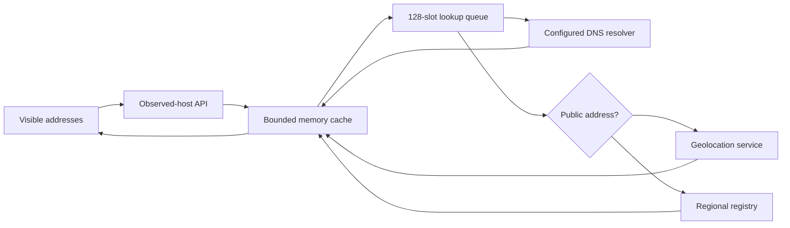

# Reverse DNS, geolocation and WHOIS / RDAP

The visual workspace adds cached address context to Flow Log, Hosts, Matrix,
Live inference, Flow Inspector and the network graph. **Investigate → Identity
& location** shows full PTR names, geographic fields, ASN/network, registry
allocation, source and cache timestamps. Country flags always use geolocation;
the allocation's registration country is displayed separately.

## Enable and configure

This feature is available in the visual workspace development preview. Existing
installations keep external lookups disabled until explicitly enabled:

```json
{
  "enrichment": {
    "enabled": true,
    "reverse_dns": true,
    "geo": true,
    "whois": true,
    "geo_url": "https://api.country.is",
    "resolver": "",
    "cache_ttl": "6h",
    "negative_ttl": "15m",
    "timeout": "4s",
    "max_entries": 4096
  }
}
```

Restart the daemon after changing this block. SIGHUP reports it as
restart-required. Empty `resolver` uses the daemon host's system DNS resolver.
For internal PTR zones, set an IP and port for your internal DNS server, for
example `192.168.50.1:53` or `[fd00::53]:53`. Each lookup stage has the configured
timeout. Disable individual providers with their booleans.

Geolocation uses the [Country API](https://country.is/), which supports a
self-hosted deployment with the same response contract. Set `geo_url` to that
base URL for locally hosted geography. The public service supplies approximate
IP geography; city, coordinates, accuracy radius, timezone and ASN may be absent.
Private/special-use addresses are not sent to external geography or registration
services. A private address can still receive PTR context from your DNS resolver.

WHOIS-style network ownership context is obtained over HTTPS through
[RDAP bootstrap](https://about.rdap.org/) and regional registry services. The
view keeps the network name, handle, allocation range, type, registration country
and last-changed timestamp. It does not retain contact emails, registrant
personal addresses or raw registry responses. Registration country is not a
physical-location assertion.

## Cache and data flow



Only hosts already seen in the investigation index are eligible. The frontend
batches up to 64 addresses; concurrent requests for an address share one job.
Four workers start at most two jobs per second. A full queue/cache reports
`busy` and the UI retries. Completed entries are evicted by least-recent access
when the configured bound is reached. Default successful retention is six hours;
unavailable/not-found/rate-limited results retry after fifteen minutes. If any
provider failed, the shorter lifetime applies to that combined record.

Expired entries remain visible with `stale: true` while refreshed. The cache is
in memory and clears on restart. Browser refresh does not bypass server TTLs.
Enrichment runs outside capture, feature extraction and inference; it never
changes a model input, score or verdict. It queries only displayed/inspected
addresses rather than proactively looking up the entire traffic stream.

## API

`GET /api/v1/enrichment?ip=192.168.50.10&ip=203.0.113.20` requires the viewer
role when authentication is enabled. Supply 1–64 repeated `ip` parameters.
Malformed addresses or IPv6 zone identifiers return 400. Valid unobserved
addresses return `status: "unobserved"` without a lookup. Responses carry
`Cache-Control: no-store`; operational names remain server-side telemetry.

Each host has `ip`, `scope`, `status`, `stale`, `updated_at`, `expires_at`,
and `dns`, `geo`, `whois` sections. Provider states are `ok`, `not_found`,
`not_applicable`, `disabled`, `error`, or `rate_limited`. The combined record
also uses `pending`, `refreshing`, and `busy`. A missing country means no flag;
the console does not infer geography from address ownership or PTR suffixes.

## Troubleshooting

| Symptom | Check |
|---|---|
| Disabled in configuration | Enable the block and restart the daemon |
| Internal names missing | Use your internal DNS resolver; verify PTR records exist |
| Private address has no flag/WHOIS | Expected: it has no public allocation or geographic lookup |
| Lookup unavailable | Daemon DNS/HTTPS egress and provider availability; retry follows negative TTL |
| Queue busy | Newly displayed host count and bounded worker capacity; results fill progressively |
| Old name persists | Updated/expiry timestamps; normal TTL caching |
| Correct ASN but unexpected city | IP geography is approximate, especially with anycast, VPNs and mobile networks |

PTR names and external provider text are untrusted advisory context. The UI
renders them as text, not executable markup. Public documentation uses
synthetic examples, never cached live names.


## Names observed in traffic

Rich or local packet capture can add **Associated names** from observed DNS A/AAAA answers, TLS ClientHello SNI and plaintext HTTP Host headers. Each entry keeps its source, observation time and expiry. Local hosts-file aliases are also separate. None replaces the reverse-DNS PTR field, changes geolocation or becomes a raw numeric neural input.

The association cache is bounded by the configured host limit and 16 names per address. TTLs are capped at 24 hours; expired entries disappear. SNI and HTTP Host mean a client requested that name at the destination, not that the server successfully served it. Observed DNS mappings are not a complete passive-DNS database or a proof of ownership. Private addresses can have locally observed names without external lookup.

A short or encrypted handshake can leave the name unknown. DNS over HTTPS/TLS, QUIC and split TCP headers are not decoded into these associations. The graph still represents observed conversations rather than physical routes or confirmed hosted websites.
